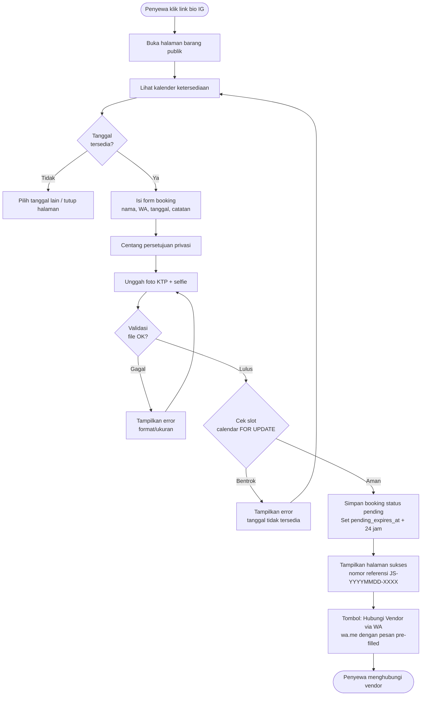
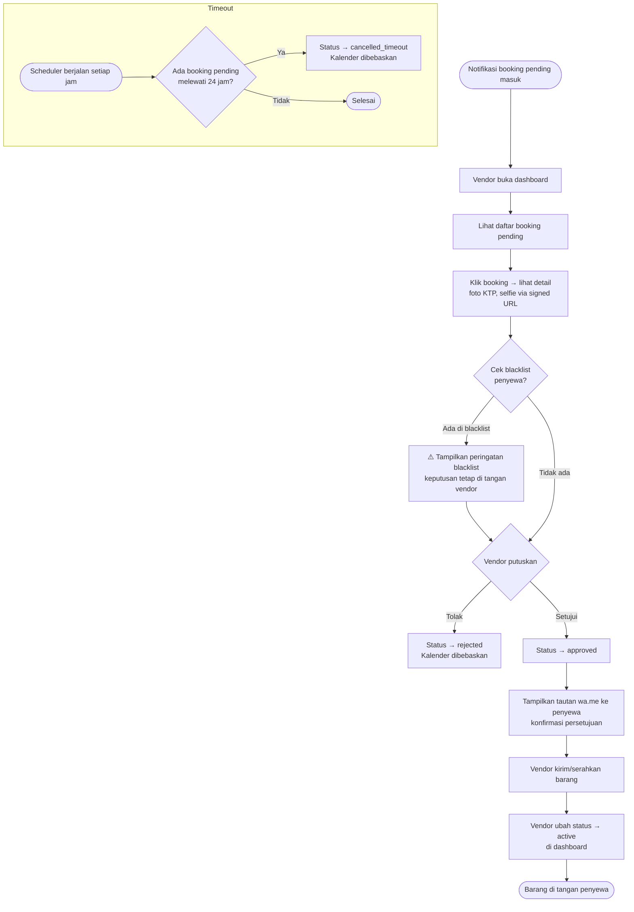
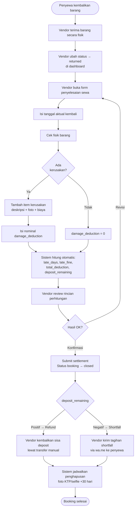

# User Flow — JagaSewa MVP

---

## (a) Alur Penyewa Memesan

```mermaid
flowchart TD
    A([Penyewa klik link bio IG]) --> B[Buka halaman barang publik]
    B --> C[Lihat kalender ketersediaan]
    C --> D{Tanggal\ntersedia?}
    D -- Tidak --> E[Pilih tanggal lain / tutup halaman]
    D -- Ya --> F[Isi form booking\nnama, WA, tanggal, catatan]
    F --> G[Centang persetujuan privasi]
    G --> H[Unggah foto KTP + selfie]
    H --> I{Validasi\nfile OK?}
    I -- Gagal --> J[Tampilkan error\nformat/ukuran] --> H
    I -- Lulus --> K{Cek slot\ncalendar FOR UPDATE}
    K -- Bentrok --> L[Tampilkan error\ntanggal tidak tersedia] --> C
    K -- Aman --> M[Simpan booking status pending\nSet pending_expires_at + 24 jam]
    M --> N[Tampilkan halaman sukses\nnomor referensi JS-YYYYMMDD-XXXX]
    N --> O[Tombol: Hubungi Vendor via WA\nwa.me dengan pesan pre-filled]
    O --> P([Penyewa menghubungi vendor])
```

---

## (b) Alur Vendor Menyetujui dan Mengirim

```mermaid
flowchart TD
    A([Notifikasi booking pending masuk]) --> B[Vendor buka dashboard]
    B --> C[Lihat daftar booking pending]
    C --> D[Klik booking → lihat detail\nfoto KTP, selfie via signed URL]
    D --> E{Cek blacklist\npenyewa?}
    E -- Ada di blacklist --> F[⚠️ Tampilkan peringatan blacklist\nkeputusan tetap di tangan vendor]
    F --> G{Vendor putuskan}
    E -- Tidak ada --> G
    G -- Tolak --> H[Status → rejected\nKalender dibebaskan]
    G -- Setujui --> I[Status → approved]
    I --> J[Tampilkan tautan wa.me ke penyewa\nkonfirmasi persetujuan]
    J --> K[Vendor kirim/serahkan barang]
    K --> L[Vendor ubah status → active\ndi dashboard]
    L --> M([Barang di tangan penyewa])

    subgraph Timeout
        N([Scheduler berjalan setiap jam]) --> O{Ada booking pending\nmelewati 24 jam?}
        O -- Ya --> P[Status → cancelled_timeout\nKalender dibebaskan]
        O -- Tidak --> Q([Selesai])
    end
```

---

## (c) Alur Pengembalian, Pengecekan, dan Hitung Denda

```mermaid
flowchart TD
    A([Penyewa kembalikan barang]) --> B[Vendor terima barang secara fisik]
    B --> C[Vendor ubah status → returned\ndi dashboard]
    C --> D[Vendor buka form penyelesaian sewa]
    D --> E[Isi tanggal aktual kembali]
    E --> F[Cek fisik barang]
    F --> G{Ada\nkerusakan?}
    G -- Ya --> H[Tambah item kerusakan\ndeskripsi + foto + biaya]
    H --> I[Isi nominal damage_deduction]
    G -- Tidak --> I2[damage_deduction = 0]
    I --> J[Sistem hitung otomatis:\nlate_days, late_fine,\ntotal_deduction, deposit_remaining]
    I2 --> J
    J --> K[Vendor review rincian perhitungan]
    K --> L{Hasil OK?}
    L -- Revisi --> D
    L -- Konfirmasi --> M[Submit settlement\nStatus booking → closed]
    M --> N{deposit_remaining}
    N -- Positif → Refund --> O[Vendor kembalikan sisa deposit\nlewat transfer manual]
    N -- Negatif → Shortfall --> P[Vendor kirim tagihan shortfall\nvia wa.me ke penyewa]
    O --> Q[Sistem jadwalkan penghapusan\nfoto KTP/selfie +30 hari]
    P --> Q
    Q --> R([Booking selesai])
```
